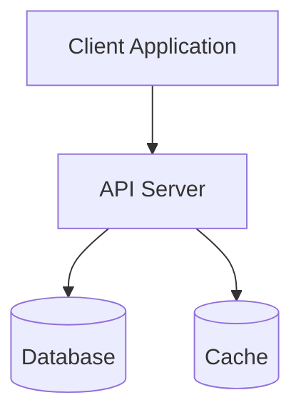

# System Overview

## Architecture Diagram

```mermaid
flowchart TD
    Client[Client Application]
    API[API Server]
    DB[(Database)]
    Cache[(Cache)]

    Client --> API
    API --> DB
    API --> Cache
```

## Core Technologies
Document your core technologies and frameworks here.
