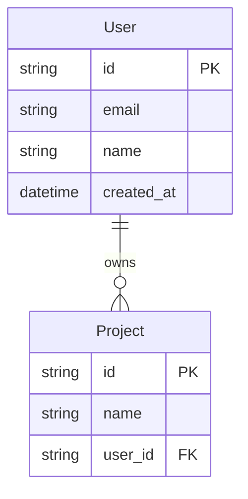

# Database Schema

## Full System ERD

```mermaid
erDiagram
    User {
        string id PK
        string email
        string name
        datetime created_at
    }

    Project {
        string id PK
        string name
        string user_id FK
    }

    User ||--o{ Project : owns
```

Document your complete database schema with all entities and relationships.

## Schema Overview
- Total tables:
- Key relationships:
- Storage engine:
