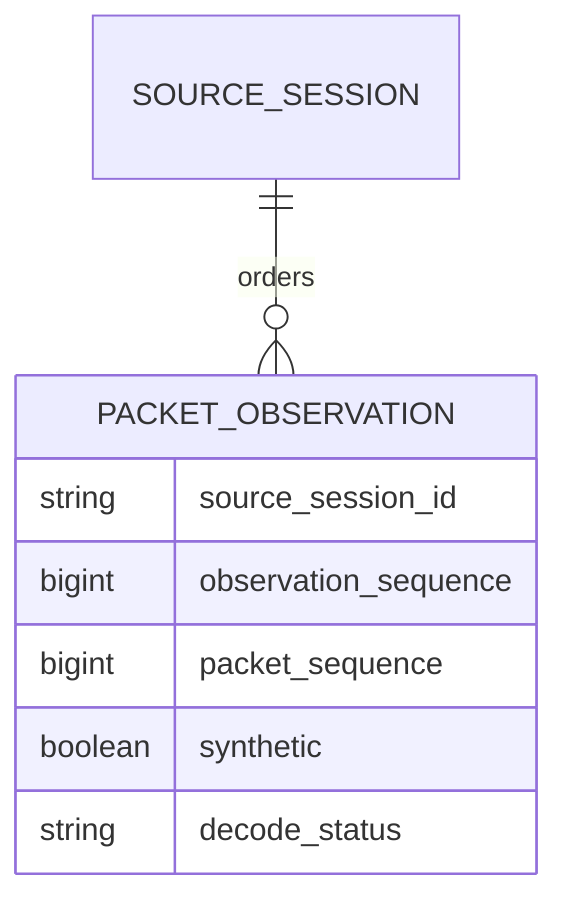

# SC-1618 transport data model

```mermaid
erDiagram
  SOURCE_SESSION ||--o{ PACKET_OBSERVATION : orders
  PACKET_OBSERVATION {
    string source_session_id
    bigint observation_sequence
    bigint packet_sequence
    boolean synthetic
    string decode_status
  }
```

A v2 observation sequence is allocated once per source and applies to both real observations and GAPs. Capture sequence remains nullable on GAPs.
